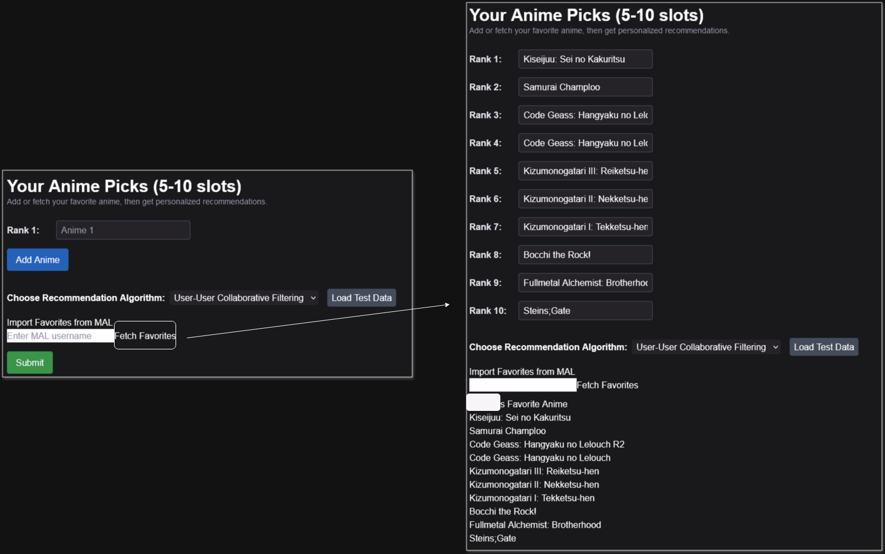

# Anime Recommendation System: Hybrid Approach with Flask and hnswlib

## Overview

This application is a **hybrid anime recommendation system** combining **collaborative filtering (user-user)** with **content-based recommendations**. It uses **hnswlib** for fast approximate nearest neighbor (ANN) search, a **Flask backend** for API handling, and a **SQLAlchemy database** for data storage.

---

## Features

- **User-User Collaborative Filtering**:
  - Finds similar users based on anime ratings.
  - Recommends anime liked by similar users.
- **Content-Based Recommendations**:
  - Suggests anime with similar genres to a user's favorites.
- **Autocomplete API**:
  - Provides anime name suggestions for user input.
- **Optimized Performance**:
  - Sparse matrix representation for memory efficiency.
  - hnswlib ANN indexing for fast nearest neighbor search.
- **Scalable Architecture**:
  - Handles thousands of users and anime with efficient memory usage.

---

## System Workflow

### 1. **Initialization**

1. **Load Environment Variables**:

   - Load `DATABASE_URL` and `SECRET_KEY` from `.env`.
   - Throw errors if not set.

2. **Database Connection**:

   - Establish a SQLAlchemy connection pool.
   - Verify connection liveness with `pool_pre_ping`.

3. **Load Anime Data**:

   - Fetch `anime_id` and `name` into `anime_df` for fuzzy matching and mapping.

4. **Build hnswlib Index**:
   - Check for existing index and mappings on disk.
   - If unavailable, build the user-anime interaction matrix and create a new index.

---

### 2. **Data Preparation**

#### Sparse User-Anime Matrix

- **Fetch Ratings**:
  - Load user ratings (`user_id`, `anime_id`, `rating`) from the database.
  - Replace `-1` with `0` to indicate no rating.
- **Map IDs to Indices**:
  - Assign users to rows and anime to columns.
- **Construct Matrix**:
  - Create a **Compressed Sparse Row (CSR)** matrix, optimizing memory usage for large datasets.

---

### 3. **Recommendation Algorithms**

#### **Collaborative Filtering (User-User)**

1. **Find Similar Users**:

   - Use hnswlib to query the **k nearest neighbors** (similar users).

2. **Aggregate Recommendations**:

   - Collect anime highly rated by neighbors but not watched by the user.
   - Rank recommendations by rating count and score.

3. **Insert New Users**:
   - If a user is not in the index:
     - Build their vector based on their anime list.
     - Add it to the index and update the database.

#### **Content-Based Recommendations**

1. **TF-IDF Vectorization**:

   - Represent anime genres using **TF-IDF scores**.
   - Convert genres into a weighted bag-of-words format.

2. **Calculate Similarity**:

   - Use **cosine similarity** to find anime similar to the user's favorites.

3. **Generate Recommendations**:
   - Rank and return the top recommendations, excluding anime the user already liked.

---

### 4. **Endpoints**

#### `/users/recommendations` [POST]

- Accepts a `user_id` and `anime_list`.
- Supports two algorithms:
  - `user-user` (default)
  - `content-based`

#### `/api/anime-suggestions` [GET]

- Returns anime name suggestions based on a query string.

---

## Key Technologies

- **hnswlib**:

  - Fast ANN search for user similarity.
  - Space-efficient graph-based indexing.

- **Flask**:

  - Lightweight backend for API handling.
  - Supports CORS for cross-origin requests.

- **SQLAlchemy**:

  - Efficient ORM for database interactions.
  - Connection pooling for scalability.

- **scipy.sparse**:
  - Memory-efficient representation of sparse matrices.
- **TF-IDF**:
  - Transform anime genres into numerical vectors for similarity calculations.

---

## Performance Optimizations

1. **Sparse Matrix Representation**:

   - Saves memory by storing only non-zero ratings.

2. **hnswlib Indexing**:

   - Provides O(log N) query time for nearest neighbor searches.

3. **Profiling Tools**:
   - `@timeit_decorator`: Measures function execution time.
   - `@memory_profiler_decorator`: Tracks memory usage.

---

## Execution Flow

### **Startup**

1. Load environment variables.
2. Establish a database connection.
3. Fetch anime data into memory.
4. Build or load the hnswlib index.

### **User-User Recommendations**

1. Accept `user_id` and `anime_list` via API.
2. Insert the user into the hnswlib index if new.
3. Query the index for similar users.
4. Aggregate and rank recommendations.

### **Content-Based Recommendations**

1. Accept `anime_list` via API.
2. Compute cosine similarity between user’s liked anime and all anime.
3. Rank and return top results.

### **Autocomplete**

1. Accept a query string via API.
2. Fetch matching anime names from the database.

---

## Logs and Profiling Insights

### Example Logs

- **Memory Usage**:
  - Sparse matrix construction: ~2245 MB.
  - hnswlib index: ~5163 MB.
- **Execution Time**:
  - Sparse matrix: ~51 seconds.
  - hnswlib index build: ~189 seconds.

### Example Profiling Output

```plaintext
python app3.py
INFO:__main__:Database connection established.
INFO:__main__:Loading anime data from database...
INFO:__main__:Anime data loaded successfully.
INFO:__main__:Building user-anime sparse matrix and hnswlib index...
INFO:__mp_main__:Database connection established.
INFO:__mp_main__:Loading anime data from database...
INFO:__mp_main__:Anime data loaded successfully.
INFO:__main__:Fetching ratings from database...
INFO:__main__:Number of users: 73534, Number of anime: 11203
INFO:__main__:Building sparse user-anime matrix...
INFO:__main__:Sparse user-anime matrix built successfully.
Function 'build_user_anime_matrix_sparse' consumed 2245.4531 MiB of memory.
Function 'build_user_anime_matrix_sparse' executed in 51.0192 seconds.
INFO:__main__:Normalizing user vectors...
INFO:__main__:Initializing hnswlib index...
INFO:__main__:Adding user vectors to hnswlib index...
INFO:__main__:Saving hnswlib index and mappings to disk...
INFO:__main__:hnswlib index and mappings built and saved successfully.
Function 'build_hnsw_index' consumed 5163.6172 MiB of memory.
INFO:__main__:Loading hnswlib index and mappings from disk...
INFO:__main__:hnswlib index and mappings loaded successfully.
Function 'build_hnsw_index' executed in 189.7009 seconds.
```

### Frontend Deployed

https://anime-rec-db-frontend.vercel.app/users/anime

#### Frontend User-User


## Backend


### Frontend Contend Based


## Backend


## Other Frontend-tools

### Fetch favorites from MAL



### Suggestions


# Anime Recommendation System: Key Takeaways

## Technical Skills Developed

### **Backend Development**

- Designed and implemented a scalable backend using **Flask** to handle API requests efficiently.
- Integrated **Flask-CORS** to enable cross-origin requests, ensuring compatibility with frontend applications.

### **Database Management**

- Configured and connected to an **AWS RDS database**, ensuring reliability and scalability for user and anime data.
- Utilized **SQLAlchemy** for efficient ORM operations, connection pooling, and advanced SQL queries.

### **Efficient Data Structures**

- Learned to use **sparse matrices** for memory-efficient representation of user-anime rating data.
- Built a **Hierarchical Navigable Small World (HNSW)** graph for approximate nearest neighbor search with **hnswlib**.

### **Optimization and Profiling**

- Implemented custom decorators for **memory profiling** and **execution time analysis**, optimizing bottlenecks in data processing.
- Improved overall system performance for handling large datasets.

---

## Algorithmic Knowledge Gained

### **Hierarchical Navigable Small World (HNSW)**

- Applied this graph-based algorithm for efficient similarity search, enabling quick identification of similar users.

### **Collaborative Filtering**

- Built a user-user recommendation system to suggest anime based on the preferences of similar users.
- Addressed challenges like data sparsity in real-world datasets.

### **Content-Based Recommendations**

- Used **TF-IDF Vectorization** to transform anime genres into numerical vectors.
- Calculated **cosine similarity** to recommend anime with similar genres.

### **Fuzzy String Matching**

- Employed **thefuzz** (formerly fuzzywuzzy) to match anime names, enhancing user input flexibility for searches.

### **SQL-Based Aggregations**

- Designed SQL queries to aggregate popularity metrics such as average ratings and total rating counts for anime.

---

## Deployment and Scalability Skills

### **AWS Integration**

- Successfully deployed and connected an **AWS RDS database** to the backend, ensuring high availability.

### **Scalability Techniques**

- Built and managed a **hnswlib ANN index**, enabling fast approximate nearest neighbor search and scaling to large datasets with millions of users and anime.

### **Deployment Challenges**

- Encountered memory usage limits when attempting to deploy the backend on **Render**.
- The resource-intensive algorithms, such as building the sparse matrix and hnswlib index, require significant memory, which exceeded the allocation provided by Render's free tier.
- As a result, the backend could not be fully deployed online.
- **Mitigation**: Showcased the backend's functionality through locally generated results and images demonstrating successful recommendation outputs.

---

### **Problem-Solving with Algorithms**

- Developed a deeper understanding of recommendation algorithms and their application in real-world scenarios.
- Balanced accuracy and performance using approximation techniques for scalable recommendations.

### **Performance Optimization**

- Analyzed and optimized memory and computational efficiency for large-scale applications.

### **API Design**

- Designed and implemented RESTful APIs with clear separation of concerns for data retrieval, recommendation logic, and user updates.

## Key Outcomes

- Built a **hybrid recommendation system** combining collaborative filtering and content-based approaches, demonstrating expertise in data science and backend engineering.
- Integrated and applied **algorithms, data structures, and cloud-based tools** to solve real-world problems.
- Gained confidence in designing, profiling, and scaling backend systems for high-performance applications.

---
